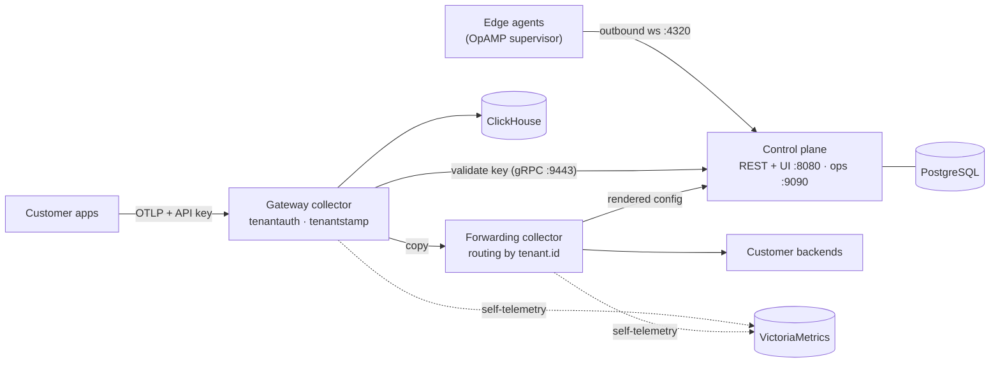

# otelfleet

[](https://github.com/jansagurna/otelfleet/actions/workflows/ci.yaml)
[](LICENSE)
[](https://jansagurna.github.io/otelfleet/)

**Self-hosted, multi-tenant OpenTelemetry collector fleet management.** Receive
logs, traces and metrics from multiple customers via OTLP, attribute every
datapoint to a tenant, store it in ClickHouse and/or forward it to each
customer's own backends — managed through a web UI.

> **Status: pre-1.0.** Under active development, not yet production-ready:
> single control-plane replica (OpAMP is process-sticky), plaintext internal
> listeners, and possible breaking changes between minors. The
> [docs](https://jansagurna.github.io/otelfleet/) are honest about the
> limitations.

## Features

- **Multi-tenant ingest** — per-customer API keys (show-once secrets); the
  gateway collector validates every OTLP request against the control plane and
  stamps `tenant.id` on every resource, overwriting anything the client sent.
  Key revocation reaches the gateways within the 30s auth cache.
- **Pipelines from the UI** — versioned processor/exporter graphs built with
  schema-driven forms, validated with the **real collector binary**
  (`otelcol validate`) before rollout, one-click rollback.
- **Two-tier gateway** — a static ingest tier that must never break, and a
  control-plane-rendered forwarding tier routing per signal by `tenant.id` to
  customer backends.
- **Edge agents via OpAMP** — collectors at customer sites (OpAMP supervisor +
  the same distro) dial out, enroll with show-once bootstrap tokens, receive
  full configs remotely, and revert locally if a pushed config crash-loops.
- **Accurate throughput metrics** — ground-truth ingest counters per tenant plus
  per-pipeline-stage sent/failed/queued from collector self-telemetry.
- **SSO, RBAC, audit** — Google, Microsoft Entra ID, GitHub, generic OIDC;
  roles admin/operator/viewer; user invites; queryable audit log. Secrets
  (SSO client secrets, pipeline credentials) AES-256-GCM-encrypted at rest.

## Architecture



One Go binary serves the REST API + embedded React SPA, the internal gRPC
API-key service, an ops listener (metrics + rendered collector configs) and the
OpAMP server. The collectors are a custom OCB distribution with two local
components, `tenantauth` and `tenantstamp`. Full story:
[architecture docs](https://jansagurna.github.io/otelfleet/architecture/).

## Quickstart

**Demo (everything in containers):**

```sh
docker compose -f deploy/compose/docker-compose.demo.yaml up -d --build
open http://localhost:8080    # dev login: any email
```

Create a customer + API key in the UI (shown once!), then generate traffic:

```sh
OTELFLEET_API_KEY=otm_... docker compose \
  -f deploy/compose/docker-compose.demo.yaml --profile loadgen up loadgen
```

**Kubernetes (Helm, bring your own PostgreSQL/ClickHouse/VictoriaMetrics):**

```sh
helm install otelfleet oci://ghcr.io/jansagurna/charts/otelfleet \
  --namespace otelfleet --create-namespace --values my-values.yaml
```

**Hacking on otelfleet** (Go 1.26+, Node 24+ with pnpm, Docker):

```sh
make dev-up
OTELFLEET_DEV_LOGIN=true OTELFLEET_MASTER_KEY=$(openssl rand -base64 32) make run
cd web && pnpm install && pnpm dev
```

Full walkthroughs: [quickstart](https://jansagurna.github.io/otelfleet/quickstart/) ·
[Helm install](https://jansagurna.github.io/otelfleet/installation/helm/) ·
[configuration reference](https://jansagurna.github.io/otelfleet/installation/configuration/).

## Repository layout

```
api/openapi.yaml     REST contract (source of truth for Go + TS codegen)
cmd/otelfleet        control-plane binary
internal/            backend packages
proto/               internal gRPC contract (API-key validation)
collector/           custom collector distro (OCB manifest + tenantauth/tenantstamp)
web/                 React SPA
deploy/              compose dev+demo envs, Helm chart, ClickHouse DDL
docs/                documentation site (MkDocs Material)
```

## Community

- **Contributing:** [CONTRIBUTING.md](CONTRIBUTING.md) — dev setup,
  conventional commits, DCO, the codegen-drift rule.
- **Bugs & ideas:** [GitHub issues](https://github.com/jansagurna/otelfleet/issues)
  (templates provided).
- **Security:** privately to security@sag-solutions.com — see
  [SECURITY.md](SECURITY.md).
- **Code of conduct:** [Contributor Covenant 2.1](CODE_OF_CONDUCT.md).
- **Releases:** tagged `v*`, images + chart on GHCR, cosign-signed — see
  [RELEASING.md](RELEASING.md).

## License

[Apache-2.0](LICENSE)
