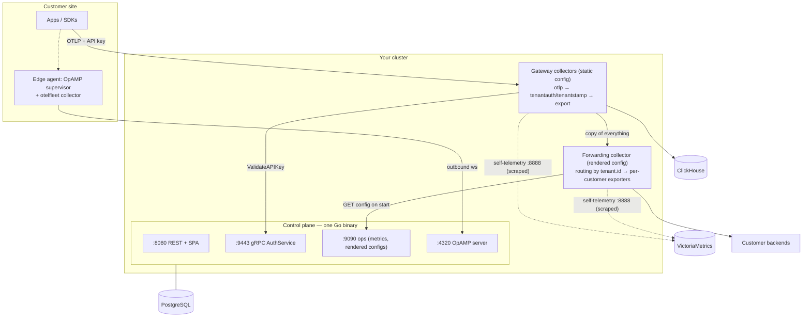

# Architecture

## The pieces



**Control plane** — a single Go binary (`cmd/otelfleet`): OpenAPI-first REST API
(chi) + embedded React SPA on `:8080`, internal gRPC `AuthService` for API-key
validation on `:9443`, ops listener (Prometheus metrics, health, rendered
collector configs) on `:9090`, OpAMP WebSocket server on `:4320`. State in
PostgreSQL (goose migrations at startup).

**Collector distribution** — a custom OCB build (`collector/builder-config.yaml`,
release train v0.156.0) with two local components: `tenantauth` (server
authenticator) and `tenantstamp` (attribution processor), plus curated upstream
components (routing/count connectors, clickhouse/prometheusremotewrite/otlp/…
exporters). One binary serves gateway, forwarding tier and edge agents.

## Why two gateway tiers?

The ingest path and the forwarding path have opposite change characteristics, so
they are separate collectors:

- **Ingest tier (gateway)** — *static* config, owned by operations, changes
  rarely. It must never break: it authenticates (`tenantauth`), stamps tenants
  (`tenantstamp`), counts (`count` connector), writes ClickHouse (persistent
  sending queue), and forwards a copy downstream. Customer actions cannot touch
  its config.
- **Forwarding tier** — config is *data*, rendered by the control plane from
  customer pipelines and changing with every activation. If a rendered config is
  bad (which validation makes unlikely), only forwarding is at risk — ingest and
  storage keep running, and the collector keeps its last config anyway.

The gateway sends an unconditional copy of all ingested data to the forwarding
tier over OTLP with a memory-only queue: if forwarding is down, that queue fills
and the copy is dropped while the ClickHouse branch is unaffected (per-exporter
queues are independent). Routing conditionally at ingest (so only tenants with
forwarding pipelines are copied) is a known future optimization.

## Per-signal routing connectors

The rendered forwarding config fans data out with the `routing` connector, keyed
on the stamped `tenant.id` resource attribute. Contrib v0.156 requires **one
routing connector instance per signal** (logs/traces/metrics), so the renderer
emits `routing/logs`, `routing/traces`, `routing/metrics`, each with a routing
table mapping tenants to their pipelines and `default_pipelines: []` — data from
tenants without forwarding pipelines is dropped in the forwarding tier by
design.

Customer pipelines become collector pipelines named
`<signal>/<customerSlug>__<pipelineSlug>` consuming from the signal's routing
connector.

## The metric contract

Two metric families power the UI, both queryable in any Prometheus-compatible
store:

1. **Ground-truth ingest counters** from the gateway's `count` connector,
   exported via Prometheus remote-write with resource-to-telemetry conversion
   (`tenant.id` becomes a label):
   `otelfleet.ingest.log_records`, `otelfleet.ingest.spans`,
   `otelfleet.ingest.metric_points`.
2. **Collector self-telemetry** (`otelcol_exporter_sent_*`,
   `otelcol_exporter_send_failed_*`, queue gauges, …), scraped from each
   collector's `:8888` (vmagent in compose; labeled with `collector_class`).

The naming convention *is* the contract (see `internal/pipelines/naming.go`):
rendered component IDs embed the pipeline —

```
collector pipeline:   <signal>/<customerSlug>__<pipelineSlug>
exporter/processor:   <type>/<customerSlug>__<pipelineSlug>__<nodeName-or-index>
```

so the `exporter` label of `otelcol_exporter_*` metrics matches
`^[^/]+/<customerSlug>__<pipelineSlug>__.*` for exactly one pipeline. That regex
is how the stage-metrics API attributes sent/failed/queued to pipelines. Renaming
a customer or pipeline slug changes the metric identity — historical continuity
across renames is not attempted.

## OpAMP flow (edge agents)

1. Supervisor connects to `ws(s)://…:4320/v1/opamp` with
   `Authorization: Bearer <bootstrap token>`; the token (hashed at rest, expiry /
   max-uses / revocation enforced) binds the connection to a customer.
2. The control plane enrolls or recognizes the agent, records lifecycle events,
   and pushes the customer's rendered edge config when its hash differs from what
   the agent reports.
3. The supervisor applies the config to its child collector and reports health,
   effective config and `RemoteConfigStatus` (APPLIED / FAILED).
   `remoteConfigStatus = applied` is the authoritative "config is live" signal;
   the fleet page's `configInSync` chip is an advisory hash comparison.
4. Edge-pipeline activation pushes to all connected agents of the customer;
   offline agents get the config on next connect.
5. The supervisor persists the last-good config and reverts to it locally if a
   pushed config crash-loops the collector — a bad push cannot brick a fleet.

Edge configs are validated with the same real-binary `otelcol validate` as
forwarding configs before they can be activated.

## Storage layout

- **PostgreSQL** — customers, API keys (hashes), pipelines + versions, agents,
  bootstrap tokens (hashes), users/identities, SSO providers (secrets
  AES-256-GCM-encrypted), audit log.
- **ClickHouse** — telemetry, tenant-keyed schema owned by
  `deploy/clickhouse/schema/` (the exporter runs with `create_schema: false`;
  DDL must be kept in sync with the pinned exporter's insert statements).
- **VictoriaMetrics** (or any Prometheus-compatible remote-write + query store) —
  ingest counters and collector self-telemetry.

## Known limitations

- **One control-plane replica.** OpAMP WebSockets are process-sticky; horizontal
  scale-out of the control plane awaits an OpAMP gateway design.
- **Plaintext internal listeners.** gRPC :9443, ops :9090 and OpAMP :4320 have
  no TLS; isolate them at the network layer and terminate TLS in front of OpAMP
  for internet-facing edge agents.
- **Forwarding rollout needs a restart** in `publish` mode (compose / Helm
  `deployment` mode). `operator` mode removes this via CR patching.
- **Copy-everything to the forwarding tier**, even for tenants with no
  forwarding pipelines (dropped there); conditional routing at ingest is future
  work.
- **No per-tenant quotas or rate limits** yet.
- **No master-key rotation** yet (ciphertext format is versioned to allow it).
- The supervisor image patches the `opamp` extension into the OCB manifest at
  build time until it moves into `builder-config.yaml`.
