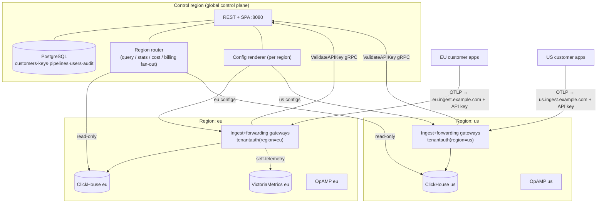

# Design: Multi-region & data residency

Status: **proposed** · Author: platform · Supersedes: nothing · Audience:
engineering (not part of the user-facing docs nav).

## Goal

Let an operator run otelfleet across several regions and **pin each customer to
a home region**, with a hard guarantee that the customer's telemetry (logs,
traces, metrics) is **stored and processed only in that region**. Secondary
goal: geographic proximity / blast-radius isolation.

Non-goals (v1): active-active replication of a single customer across regions;
automated live region migration; per-region sharding of the control-plane
*metadata* (see "Residency boundary").

## What "residency" means here

We separate two data classes:

| Class | Examples | v1 residency guarantee |
|---|---|---|
| **Telemetry** (the payload) | log bodies, spans, metric points, stored in ClickHouse; the forwarded copies | **Regional at rest and in transit.** Never written to, or routed through, a region other than the customer's home region. This is the hard guarantee. |
| **Control metadata** | customer name/slug, pipeline config, API-key *hashes*, user accounts, audit log (PostgreSQL) | Lives in the **control region** in v1. Operator queries (Explore/stats) may read a region's telemetry to the operator's browser. Hardened in Phase 4. |

This split is the crux of the design: the sensitive, high-volume payload is
strictly regional; the small control plane is global for operability. We state
this explicitly so customers with strict metadata-residency needs know the v1
boundary (and Phase 4 closes it).

## Current architecture (recap)

Single deployment today: one control-plane binary (REST+SPA `:8080`, OpAMP
`:4320`, gRPC `ValidateAPIKey :9443`, ops `:9090`), a two-tier collector fleet
(ingest tier: `tenantauth` + `tenantstamp` → ClickHouse; forwarding tier:
routing connector → per-tenant exporters), one ClickHouse (tenant-keyed:
`TenantId` leads the ORDER BY), VictoriaMetrics for self-telemetry, PostgreSQL
for the control plane. Every datapoint carries `tenant.id` = the customer's
`client_id`. Read paths (Explore, `/stats`, `/costs`, billing) query the one
ClickHouse.

The design below is **additive**: with a single region configured it is
behaviourally identical to today.

## Target topology

- **Data plane is per-region**: each region has its own ingest+forwarding
  gateways, ClickHouse, VictoriaMetrics, and OpAMP endpoint. A customer's
  telemetry only ever touches its home region's data plane.
- **Control plane is global** (one PostgreSQL + API/SPA/OpAMP-orchestration in
  a control region). It never stores telemetry; it holds metadata and *reads*
  regional ClickHouse on demand for the UI.

## The residency-enforcing mechanism (ingest)

Residency is only real if telemetry cannot be written to the wrong region.
Two viable ingest models:

- **(A) Explicit regional endpoints** — `eu.ingest.example.com`,
  `us.ingest.example.com`. The customer sends OTLP to *their* region's
  endpoint. Chosen. ✔
- (B) One global anycast endpoint that routes to the home region — rejected: it
  necessarily *ingests* payload in a non-home region before routing, breaking
  residency.

With (A), the guardrail is in **`tenantauth`**: each region's gateway is
deployed with `OTELFLEET_REGION=<region>`. `ValidateAPIKey` returns the
customer's pinned region; the gateway **rejects (401) a key whose home region
≠ the gateway's region**. So even if a customer misconfigures their endpoint,
their data is refused, never stored out-of-region. The rejection surfaces as an
`auth_requests_total{outcome="wrong_region"}` metric and a clear error.

`ValidateAPIKey` is control-metadata (key hash lookup + region), served by the
global control plane to all regional gateways. If a deployment needs even auth
lookups to stay regional, Phase 4 adds regional read-replicas of the
`api_keys`+`customers.region` projection.

## Read path (Explore / stats / cost / billing)

Today these query the single ClickHouse. They become **region-aware** via a
small **region router** in the control plane:

- A registry maps `region → ClickHouse DSN` (from config), holding one
  connection pool per region.
- **Per-customer queries** (`/customers/{id}/logs|traces`, throughput) resolve
  the customer's region and hit **only that region's** ClickHouse.
- **Fleet-wide aggregates** (`/stats/overview`, `/costs`, billing statement)
  **fan out** to all regions in parallel and merge (sum totals, concat/sort
  per-customer rows). Each region already returns per-`TenantId` rows, so the
  merge is the same code path as today, just over N result sets.
- Tenant-scoped RBAC composes cleanly: filter customers first, then only query
  the regions those customers live in.

Operator reads crossing regions to the browser are operator access, not
customer-to-customer leakage; the data at rest stays put. Documented.

## Control-plane responsibilities that become per-region

- **Config rendering**: the forwarding-tier and edge configs are already
  rendered per customer; group by region and publish each region's bundle to
  that region's gateways (the existing ops endpoint / distributor, one per
  region) and OpAMP server. `EdgeConfigChanged` fans out to the customer's
  region only.
- **OpAMP**: edge agents connect to their region's OpAMP endpoint
  (`OTELFLEET_OPAMP_PUBLIC_ENDPOINT` is already per-deployment). The control
  plane's OpAMP orchestration addresses regions via the existing
  LISTEN/NOTIFY-decoupled push, extended with a region key.
- **VictoriaMetrics**: per region; the stats PromQL proxy queries the home
  region's VM (or fans out for fleet views).

## Data model & code touch-points

Grounded in the current code:

1. **`customers.region`** — new `TEXT NOT NULL DEFAULT '<primary>'` column
   (migration), `store.Customer.Region`. **Immutable after creation in v1**
   (changing it requires a data move — see Migration). Surfaced in the API
   (`Customer` schema) and the create-customer form (region picker); the
   customer detail page shows the region + its **regional ingest endpoint**.
2. **Region registry / config** — `OTELFLEET_REGIONS` describing each region:
   name, ClickHouse DSN, VM URL, OpAMP public endpoint, ingest hostname. The
   control plane builds per-region connection pools; each **gateway** is
   deployed with its single `OTELFLEET_REGION`.
3. **`ValidateAPIKey` (gRPC `AuthService`)** — response gains `region`;
   `tenantauth` gains a configured region and the reject-on-mismatch rule +
   `wrong_region` outcome metric.
4. **Region router** — `internal/regions` (new): `region → *clickhouse pool`;
   used by `internal/query`, `internal/stats` (`GetOverview`/`GetCost`),
   billing. Per-customer → single region; aggregates → fan-out+merge.
5. **Config rendering / distributor / OpAMP** — thread `region` through
   `pipelines.RenderCurrent`/forwarding distribution and the OpAMP push so each
   region only gets its customers' configs.
6. **Deployment** — the umbrella Helm chart gains a `region` value; a full
   deployment is **one control-plane release** + **one data-plane release per
   region** (gateways + ClickHouse + VM + OpAMP). The control-plane release is
   given the region registry (ClickHouse read DSNs, ingest hostnames).

## Phasing

Each phase is shippable and additive; a single-region install keeps working
throughout.

| Phase | Scope | Demo / exit criterion |
|---|---|---|
| **0 — Region model** | `customers.region` (immutable), region registry config, region picker in UI, regional ingest endpoint shown per customer. Everything still one region. | Create a customer in region `eu`; its ingest endpoint + region show in the UI; nothing else changes. |
| **1 — Ingest enforcement** | `ValidateAPIKey` returns region; `tenantauth` rejects cross-region keys (`wrong_region` metric); regional ingest hostnames. | A key for an `eu` customer used against the `us` gateway is refused; used against `eu`, data lands in `eu` ClickHouse. |
| **2 — Region-aware reads** | region router; per-customer queries hit home region; fleet aggregates fan out + merge; tenant-scope composes. | Explore/costs/billing correct with two regional ClickHouses; a customer's logs only ever come from its region. |
| **3 — Regional control functions** | per-region config rendering, forwarding distribution, OpAMP push, VM. | Activate a pipeline for a `us` customer → only `us` forwarding tier reloads; `eu` untouched. |
| **4 — Strict-residency hardening (optional)** | regional read-replica of the auth projection; regional audit sink; region migration tooling (export/import a customer's ClickHouse partitions between regions with a documented cutover). | Auth lookups and audit for a region stay in-region; a customer can be moved `eu`→`us` via a runbook. |

## Key decisions

- **Regional endpoints, region-bound keys** are the residency mechanism (not
  smart global routing). Simple, auditable, fail-closed.
- **Global control plane + regional data plane** in v1: the payload is strictly
  regional; metadata is global for operability. Phase 4 offers metadata
  hardening for customers who need it.
- **Region is immutable per customer** in v1; migration is an explicit
  operator runbook, not an online feature.
- **Additive**: single-region behaviour is unchanged; `region` defaults to the
  primary region everywhere.

## Risks & mitigations

- **Cross-region query latency / a region down** → per-region pools have short
  timeouts; fleet aggregates degrade gracefully (mark a region's slice
  unavailable rather than failing the whole dashboard), mirroring today's
  `ErrUpstreamUnavailable` handling.
- **Metadata-residency expectations** → documented boundary; Phase 4 path.
- **Misrouted ingest** → fail-closed reject in `tenantauth`; never silently
  store out-of-region.
- **Operational complexity (N stacks)** → the Helm `region` param + a single
  control-plane holding the registry keeps each region a cookie-cutter install.
- **ClickHouse schema drift across regions** → the existing pinned schema +
  `create_schema:false` DDL is applied identically per region in CI.

## Open questions

- Should fleet-wide **billing** be presentable per-region (a residency/tax
  angle) in addition to per-customer? (Cheap to add once the router fans out.)
- Do we need **per-region admin roles** (an operator scoped to one region),
  composing with tenant-scoped RBAC?
- Control-region **failover**: the data planes keep ingesting if the control
  region is briefly down (the gateways' `tenantauth` cache serves stale for the
  TTL, as today) — quantify the acceptable window.
