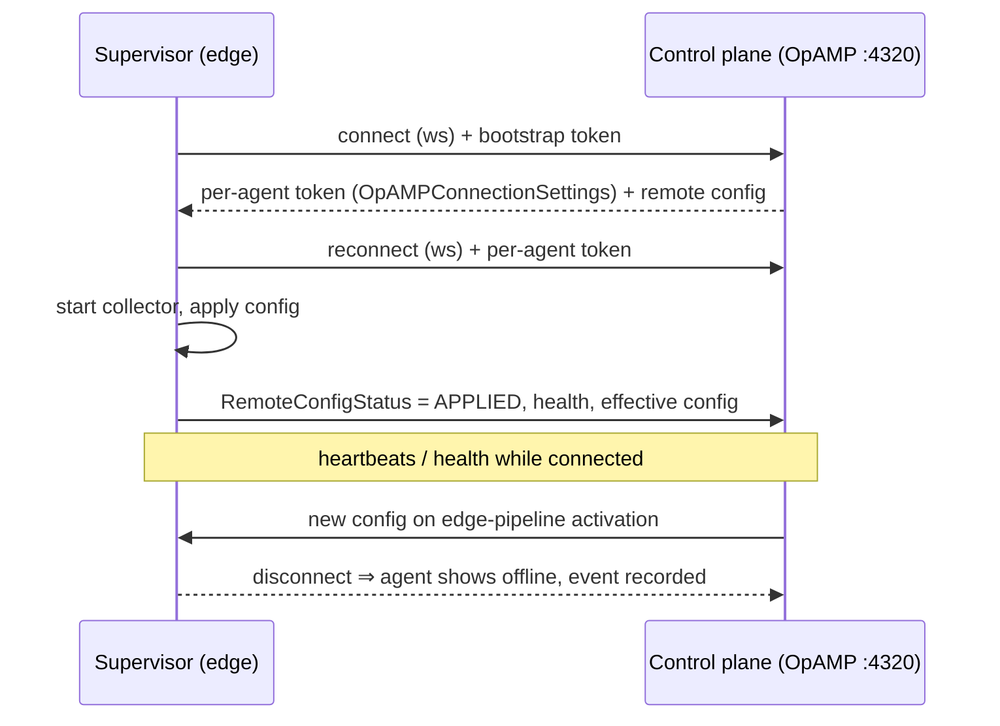

# Edge agents

Edge agents are otelfleet collectors running inside customer networks, managed
centrally over [OpAMP](https://opentelemetry.io/docs/specs/opamp/). Each agent is
the official **OpAMP supervisor** (v0.156.0) running the otelfleet collector
distribution as a child process.

Key property: agents only make **outbound** connections — a WebSocket to the
control plane's OpAMP server (`/v1/opamp`, port 4320). Nothing in the customer
network needs to be reachable from outside.

## Enrollment

1. Create a **bootstrap token** for the customer (UI: customer → bootstrap
   tokens, or `POST /api/v1/customers/{id}/bootstrap-tokens`). Tokens are
   **show-once** (hashed at rest), and support expiry and max-use limits.
2. Start the agent with the token. With the compose dev/demo environment:

    ```sh
    OTELFLEET_BOOTSTRAP_TOKEN=otm_bt_<prefix>_<secret> \
      docker compose --profile edge up -d edge-agent
    ```

    (The `edge-agent` service sits behind the `edge` profile because it needs a
    real token; a plain `up -d` never starts it.)

3. The supervisor connects with `Authorization: Bearer <token>`, the control
   plane enrolls the agent under that customer and immediately pushes its
   rendered config (the customer's active edge pipelines — or a safe empty-state
   config if there are none).

For your own deployments, run the `ghcr.io/jansagurna/otelfleet-supervisor`
image with a supervisor config modeled on `deploy/compose/supervisor.yaml`,
pointing at your control plane:

```yaml
server:
  endpoint: wss://otelfleet.example.com:4320/v1/opamp
  headers:
    Authorization: "Bearer ${env:OTELFLEET_BOOTSTRAP_TOKEN}"
```

## Lifecycle



- Config pushes happen on connect (only when the hash differs) and whenever an
  edge pipeline of the customer is activated.
- The supervisor persists the **last-good config** (and its instance ID) under
  `/var/lib/otelfleet-supervisor`. If the control plane is down it starts the
  collector from the persisted config; if a pushed config crash-loops the
  collector, it **reverts locally** and reports the failure.
- Connect / disconnect / health / config-status transitions are recorded as
  events (`GET /api/v1/agents/{id}/events`, visible in the agent detail page).

## Fleet page: reading the status chips

- **Online/offline** — whether the agent's OpAMP session is currently connected.
- **Config sync** (`configInSync`) — an **advisory** comparison of assigned vs.
  reported config hashes. The **authoritative** signal that a config is live is
  the agent's reported `remoteConfigStatus = applied`. An agent can briefly show
  out-of-sync while applying, and the config diff view
  (`GET /api/v1/agents/{id}/config`) shows exactly what differs.
- Deleting an agent that is still connected is refused (HTTP 409) — stop the
  agent first.

## Operational notes

- The OpAMP listener is plaintext WebSocket (`ws://`); for agents on the
  internet, terminate TLS in front of it (`wss://`) — see
  [Helm: exposing OpAMP](../installation/helm.md#exposing-opamp-to-edge-agents).
- Keep a single control-plane replica: OpAMP sessions are process-sticky.
- **Per-agent tokens.** On the first bootstrap-authenticated connection the
  control plane issues the agent its own token (`otm_at_…`) and offers it via
  OpAMP `ConnectionSettings`; the supervisor reconnects presenting it (requires
  `accepts_opamp_connection_settings: true`, set in the shipped supervisor
  config). Because enrolled agents authenticate with their own token,
  **revoking a customer's bootstrap token only blocks new enrollments — it does
  not disturb agents already enrolled.** To lock out a single agent, delete it
  (`DELETE /api/v1/agents/{id}`); its per-agent token stops authenticating.
  Agents whose supervisor cannot accept connection settings keep using the
  bootstrap token as a fallback.
