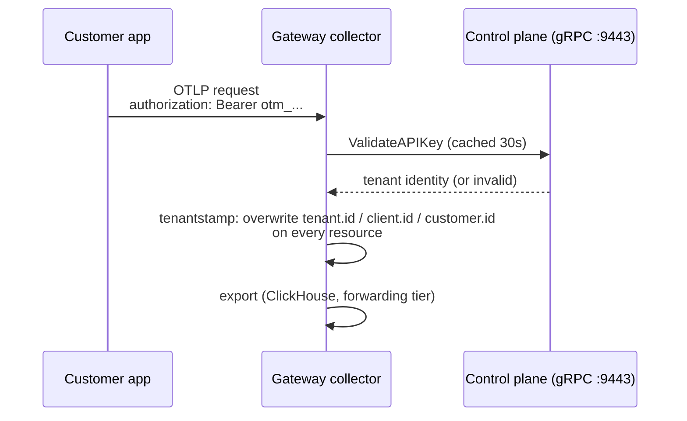

# Multi-tenancy

otelfleet's core promise: every datapoint that enters the system is attributed to
exactly one tenant, and the attribution cannot be spoofed by the sender.

## Customers, API keys, tenants

- A **customer** is the unit of tenancy. Creating one (UI or
  `POST /api/v1/customers`) assigns a stable tenant ID and a URL-safe slug.
- **API keys** (per customer, `POST /api/v1/customers/{id}/api-keys`) are the
  ingest credential. The secret is **shown exactly once** at creation — only a
  hash is stored. Treat a lost key as gone; create a new one.
- Keys can be individually revoked. Revocation propagates to the gateways within
  the `tenantauth` cache TTL — **30 seconds** in the shipped configs (the
  extension caps its cache at the server-provided TTL, so revocation always lands
  in under a minute).

## How attribution works



1. **`tenantauth`** (server authenticator extension on the gateway's OTLP
   receivers) extracts the bearer token, validates it against the control plane's
   gRPC `AuthService`, and attaches the tenant identity to the request context.
   It keeps a positive (30s) / negative (5s) cache and serves **stale-if-error**
   for up to 15 minutes if the control plane is unreachable — ingest survives
   short control-plane outages.
2. **`tenantstamp`** (processor, deliberately placed *before* `batch`, which
   drops per-request context) writes `tenant.id`, `client.id` and `customer.id`
   onto every resource — **removing any client-supplied values first** — and
   drops data that somehow arrived unauthenticated.

Everything downstream (ClickHouse schema, forwarding-tier routing, ingest
counters) keys on the stamped `tenant.id` resource attribute.

## Sending data

```sh
telemetrygen logs --otlp-insecure --otlp-endpoint <gateway>:4317 \
  --otlp-header 'authorization="Bearer <api-key>"'
```

Any OTLP exporter works the same way — set the `authorization` header to
`Bearer <api-key>` (gRPC :4317 or HTTP :4318). Invalid or revoked keys are
rejected at the receiver and are visible as refused requests in the customer's
stats.

## Throughput metrics

The gateway's `count` connector produces ground-truth ingest counters —
`otelfleet.ingest.log_records`, `otelfleet.ingest.spans`,
`otelfleet.ingest.metric_points` — exported via Prometheus remote-write with
`tenant.id` as a label (resource-to-telemetry conversion). The dashboard and
customer pages are built on these plus per-request accepted/refused counts.

## Isolation model (honest edition)

- Attribution is enforced at the gateway; tenants cannot write into each other's
  namespace because client-supplied `tenant.id` is always overwritten.
- Storage is a **shared ClickHouse schema keyed by tenant** — logical, not
  physical, isolation. There is no per-tenant encryption or row-level security.
- The forwarding tier routes strictly by stamped `tenant.id`; tenants without
  active forwarding pipelines are dropped there (the routing connector's default
  route is empty).
- Rate limiting / quotas per tenant are not implemented yet.
