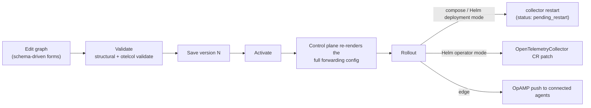

# Pipelines

Pipelines describe what happens to a customer's data after ingest: processors →
exporters, built in the UI (or via `POST /api/v1/customers/{id}/pipelines`),
versioned, validated, and rolled out to either the central forwarding tier or the
customer's edge agents.

## Target classes

| | `forwarding` (default) | `edge` |
| --- | --- | --- |
| Runs on | the central forwarding tier | the customer's edge agents (via OpAMP) |
| Input | copy of the customer's ingested data, routed by `tenant.id` | whatever the edge agent receives locally (OTLP :4317/:4318) |
| Rollout | activate → serve rendered config → collector restart (or CR patch) | activate → pushed live over OpAMP |

The two classes are rendered by isolated renderers; a customer can have both.

## Component catalog

The builder offers a curated catalog (12 components; `GET /api/v1/catalog/components`),
each backed by a JSON Schema that drives the form and validation:

- **Processors:** Batch, Memory Limiter, Filter, Transform, Attributes, Resource
- **Exporters:** OTLP (gRPC), OTLP (HTTP), Debug, ClickHouse,
  Prometheus Remote Write, File

Receivers are not part of the graph — the renderer provides them (routing
connector input on the forwarding tier; an OTLP receiver on edge agents).

## Versioning and rollout

Every save creates an **immutable version**: the graph, the rendered collector
config fragment, and its hash. Activation moves a version pointer — rollback is
just activating an older version.

### Validation is the real thing

Validation happens in two stages:

1. **Structural** — graph and JSON-Schema checks with error paths that map back
   to form fields (e.g. `exporters[0].config.endpoint`).
2. **Authoritative** — the control plane renders the full collector config and
   runs `otelcol validate` with the **actual distro binary**
   (`OTELFLEET_OTELCOL_BIN`). What validates here is exactly what the collectors
   will load. If the binary is missing, only structural validation runs.

### Forwarding-tier rollout mechanics

The forwarding collector loads its *entire* config from the control plane's ops
endpoint (`GET :9090/internal/v1/collector-config/forwarding`) via the HTTP
confmap provider.

- **compose / Helm `deployment` mode** (`OTELFLEET_DISTRIBUTOR=publish`):
  activation re-renders and re-serves the config; running collectors keep the old
  one until restarted. The pipeline shows `pending_restart` —
  `docker compose restart forwarding` or
  `kubectl rollout restart deployment/otelfleet-forwarding` applies it.
- **Helm `operator` mode** (`OTELFLEET_DISTRIBUTOR=k8s`): the control plane
  patches the `OpenTelemetryCollector` CR and the opentelemetry-operator rolls
  the pods; no manual restart.

### Edge rollout mechanics

Edge pipelines are rendered as a standalone per-customer collector config (all of
the customer's active edge pipelines merged, sharing one OTLP receiver) and pushed
over OpAMP to every connected agent of that customer immediately on activation.
See [Edge agents](edge-agents.md).

## Secrets in pipeline configs

Component fields marked as passwords in the catalog (credentials on exporters)
are:

- **encrypted at rest** with `OTELFLEET_MASTER_KEY` (AES-256-GCM) — saving a
  pipeline with password fields fails cleanly if the key is not configured;
- **never returned** by the API — reads show a redaction sentinel, and saving a
  graph with the sentinel copies the previously stored secret forward, so the
  plaintext never round-trips through the browser.

## Stage metrics

The pipeline detail page shows per-stage throughput:

- **received** per signal, from ClickHouse ingest data;
- **sent / failed / queued** per exporter, from collector self-telemetry in
  VictoriaMetrics. Rendered component IDs encode the pipeline
  (`<type>/<customerSlug>__<pipelineSlug>__<node>`), which is what makes
  per-pipeline attribution of `otelcol_exporter_*` metrics possible — see
  [the metric contract](../architecture.md#the-metric-contract).
