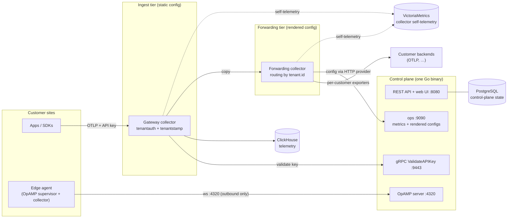

# otelfleet

Self-hosted, multi-tenant OpenTelemetry collector fleet management: receive logs,
traces and metrics from multiple customers via OTLP, attribute every datapoint to a
tenant, store it in ClickHouse and/or forward it to external backends — managed
through a web UI.

!!! warning "Pre-1.0 software — read this before deploying"

    otelfleet is under active development and **not yet ready for production use**.
    Honest limitations, as of today:

    - **Single control-plane replica.** Edge-agent OpAMP WebSockets are
      process-sticky; run exactly one control-plane replica until the
      multi-replica story lands.
    - **No TLS on internal listeners.** The control-plane gRPC (:9443), ops
      (:9090) and OpAMP (:4320) listeners are plaintext — protect them at the
      network layer (they must never be internet-facing except OpAMP behind
      your own TLS termination).
    - **Forwarding-config rollout requires a collector restart** in compose and
      Helm `deployment` mode (`operator` mode patches the CR instead).
    - Breaking changes between minor versions are possible before 1.0.

## What it does

- **Multi-tenant ingest** — create a customer in the UI, hand out an API key; the
  gateway collector authenticates every OTLP request against the control plane and
  stamps `tenant.id` on every resource before anything is stored or forwarded.
- **Pipelines from the UI** — receivers → processors → exporters as a versioned
  graph, built with schema-driven forms, validated with the *real* collector binary
  (`otelcol validate`) before rollout, with one-click rollback.
- **Two-tier gateway** — a static ingest tier (auth + tenant stamping + ClickHouse)
  and a control-plane-rendered forwarding tier that routes per-signal by `tenant.id`
  to each customer's own backends.
- **Edge agents** — collectors at customer sites run under the OpAMP supervisor,
  dial *out* to the control plane, enroll with show-once bootstrap tokens, and
  receive their full config as OpAMP remote config.
- **Accurate throughput metrics** — ground-truth ingest counters per tenant plus
  per-pipeline-stage exporter metrics (sent / failed / queued).
- **SSO and RBAC** — Google, Microsoft Entra ID, GitHub, and any generic OIDC
  provider; roles `admin` / `operator` / `viewer`; user invites; audit log.
- **Secrets encrypted at rest** — SSO client secrets and pipeline credential fields
  are AES-256-GCM envelope-encrypted with `OTELFLEET_MASTER_KEY`.

## Architecture at a glance

One Go binary (`otelfleet`) serves the REST API and embedded React SPA (`:8080`),
an internal gRPC service the gateway uses to validate API keys (`:9443`), an ops
listener for metrics/health and rendered collector configs (`:9090`), and the OpAMP
server for edge agents (`:4320`). The collectors are a custom OpenTelemetry
Collector distribution (built with OCB) that adds two components: the `tenantauth`
server authenticator and the `tenantstamp` processor.

Read the [architecture deep-dive](architecture.md) for the two-tier reasoning,
the metric naming contract, and known limitations.

## Where to go next

- [Quickstart](quickstart.md) — running locally in about five minutes.
- [Helm installation](installation/helm.md) — Kubernetes deployment.
- [Configuration reference](installation/configuration.md) — every `OTELFLEET_*`
  environment variable.
- [Guides](guides/multi-tenancy.md) — multi-tenancy, pipelines, edge agents, SSO.
